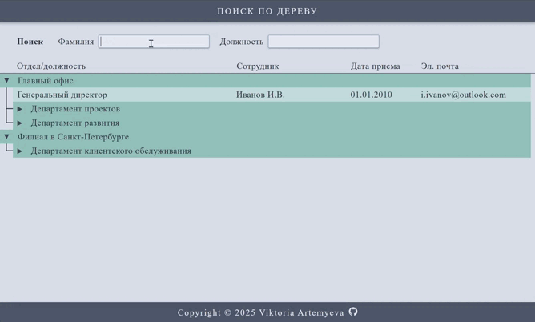

# Tree Search Application

#### An application for tree search with departments and employees

#### 🔍 Поиск по дереву 

  

 

Поиск сотрудников в древовидной структуре организации. Пользователь вводит фамилию и/или должность в поля фильтра, нажимает Enter, и результаты отображаются в виде развернутого дерева. Найденные фрагменты текста подсвечиваются, а для удобства навигации предусмотрен последовательный поиск по результатам (при повторных кликах на Enter).

## 🛠️ Основные функции

- Древовидная структура: отображение отделов и сотрудников в виде иерархического дерева.
- Фильтрация: поиск сотрудников по фамилии и/или должности.
- Автоматическое раскрытие узлов: при поиске автоматически раскрываются узлы дерева, содержащие найденных сотрудников.
- Последовательный поиск: при повторном нажатии Enter (без изменения фильтра) происходит переход к следующему найденному сотруднику.
- Подсветка предикатов: отображение введенного в фильтр текста в результатах поиска.
- Автопрокрутка: приложение автоматически прокручивает область результатов поиска к первому найденному сотруднику, а также к каждому последующему при повторных нажатиях Enter.

## 🌐 Стек технологий
- Angular
- TypeScript
- HTML5
- SCSS
- RxJs

## Установка зависимостей
`npm install`

## Запуск проекта на локальном сервере
`ng serve`

## Сборка
`ng build`
